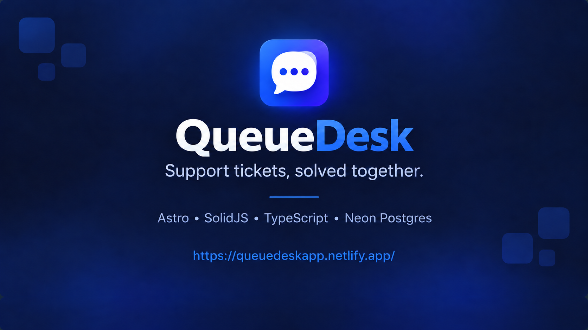

# QueueDesk

Support tickets, solved together.

## Local setup

1. Copy `.env.example` to `.env` and add development credentials.
2. Run `npm install`.
3. Apply `migrations/001_initial.sql` to the development Neon database.
4. Run `npm run dev`.

## Quality checks

- `npm run verify` runs linting, Astro checks, unit tests, and a production build.
- `npm run test:e2e` runs the Playwright flow after browser installation.

Product scope is defined in [QueueDesk_PRD.md](./QueueDesk_PRD.md).
